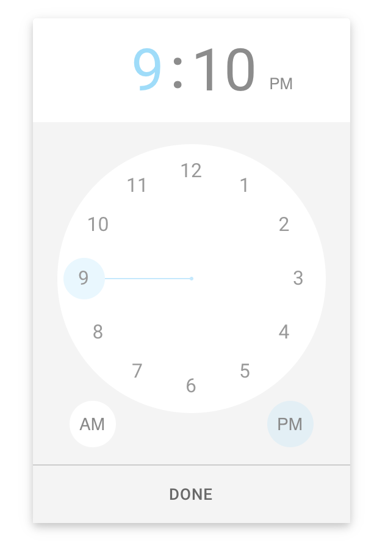

<!--
TODO
- update react spring to v9 on release
	- should fix about of typescript issues
- fix remaining typescript errors
- add units tests for components once enzyme gains better supports shallow
-->

<h1 align="center">
	
	<br/>
	React Timekeeper
</h1>

<p align="center">
  <a href="https://travis-ci.com/catc/react-timekeeper">
    
  </a>
  <a href="https://www.npmjs.com/package/react-timekeeper">
    
  </a>
  <a href="https://github.com/catc/react-timekeeper/blob/master/LICENSE">
    
  </a>
</p>

<p align="center">
	<b>
		Time picker based on the style of the
		<a href="https://play.google.com/store/apps/details?id=com.google.android.keep" target="_blank">
		Android Google Keep
		</a>
		app.
	</b>
</p>

------------

**Features**
- supports both 12 hour and 24 hour mode, and flexible time formats
- simple to use with many customizable options
- smooth, beautiful animations with [react spring](https://www.react-spring.io)
- typescript support
- css variable support for custom styles

## Installation

```shell
$ npm install --save react-timekeeper
```

Version 2+ of timekeeper requires [react hooks (v16.8)](https://reactjs.org/blog/2019/02/06/react-v16.8.0.html). If you're using an older version of react, install timekeeper v1 via
```shell
$ npm install --save react-timekeeper@^1.0.0
```

## Usage

```javascript
import React, {useState} from 'react';
import TimeKeeper from 'react-timekeeper';

function YourComponent(){
  const [time, setTime] = useState('12:34pm')

  return (
    <div>
      <TimeKeeper
        time={time}
        onChange={(data) => setTime(data.formatted12)}
      />
      <span>Time is {time}</span>
    </div>
  )
}
```

All styles are inlined via [emotion](https://github.com/emotion-js/emotion) so no css imports are required.

## API
For full api and examples, see [API docs](https://catc.github.io/react-timekeeper/#api) and [examples](https://catc.github.io/react-timekeeper/#examples)


## Development
1. Clone the repo
3. `nvm use v10.16.0` (or anything >10)
2. `npm install`
3. `npm run docs:dev`
4. Navigate to `localhost:3002`

### Contributing
Before submitting a PR, ensure that:
1. you follow all eslint rules (should be automatic)
1. all tests pass via `npm run tests`
1. everything builds
    - docs - `npm run docs:build`
    - lib - `npm run lib`
1. provide detailed info on what bug you're fixing or feature you're adding - if possible include a screenshot/gif

------------

Other useful commands:
- build docs: `npm run docs:build`
- run all tests: `npm run tests`
- watch tests: `npm run tests:watch`
- create lib to publish npm: `npm run lib`

